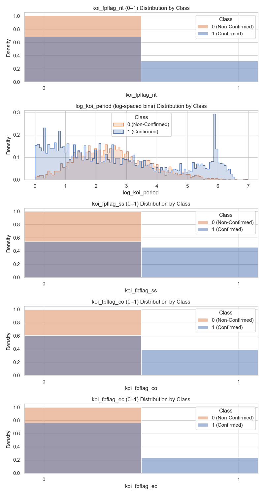
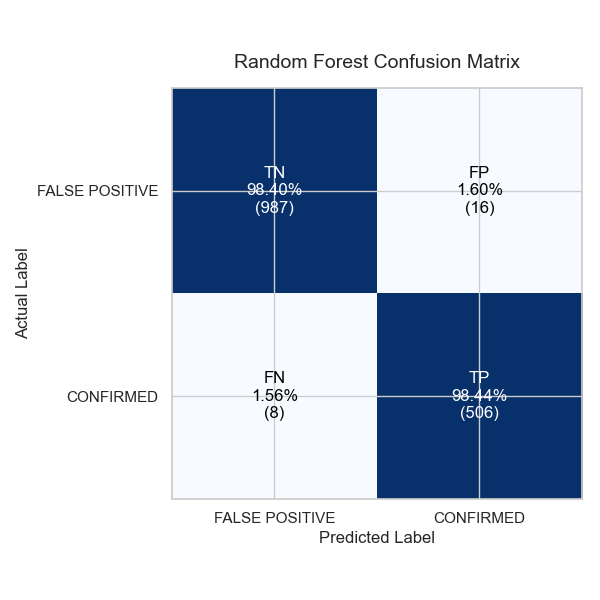

<h1 align="center"> eXoxoAi </h1>
<p align="center">
  
</p>
<p align="center">A 3D exoplanet <a href="https://exoplanet-s180.bolt.host/">visualizer!</a></p>

# Objective
The field of planet detection has been a rapidly growing area of research in astrophysics over the past few decades and has driven the development of innovative methods to detect and characterize these planets. These bodies, known as exoplanets, are planets that orbit stars outside of our solar system. In recent years, over 6,000 exoplanets have been detected using different approaches, most notably the transit method. A transit occurs when one celestial object passes in front of another, such as a planet passing in front of a star. This phenomenon is characterized by periodic decreases in brightness caused by planetary eclipses of stars along the observer’s line of sight. However, an issue arises due to the high rate of false detections, which result from eclipsing binary systems, instrumental noise, or astrophysical variability that can mimic planetary transits (Malik et al., 2021).

**eXoxoAi**, a graduate–undergraduate–built website, focuses on retrieving the dataset created by NASA’s Kepler program, known as the <a href="https://exoplanetarchive.ipac.caltech.edu/cgi-bin/TblView/nph-tblView?app=ExoTbls&config=cumulative">Kepler Object of Interest (KOI)</a> catalog. The Kepler telescope is NASA’s first planet-hunting mission, launched in 2009, which aims to advance exoplanet detection by targeting Earth-like planets orbiting Sun-like stars in the Milky Way galaxy using the transit method.

Although Kepler was designed as a statistical mission to investigate the frequency of Earth-sized exoplanets in or near habitable zones, most early results focused on individual systems (Malik et al., 2021). However, the validation of candidates identified by the Kepler mission remains an ongoing effort, since eliminating false positives is a time-consuming and resource-intensive task that requires significant manpower and funding, and new candidates continue to be discovered. Researchers have developed an interest in using artificial intelligence and machine learning (AI/ML) algorithms to increase the accuracy of pattern detection and produce better results than manual parameter elimination and analysis, especially when dealing with more complex problems or data types.

**eXoxoAi** is a vetting system that employs the Random Forest algorithm to improve the ease of exoplanet candidate classification as seen in the results of the model's confusion matrix trained on data retrieved from NASA’s Exoplanet Archive. It is a 3D web-based interface designed for early-career astrophysicists, researchers, and citizen scientists to explore open-source exoplanet datasets. A short demo is located in the repository named ```welcome_to_exoplanet_explorer.mov```.

# eXoxoAi background
The website offers an interactive data visualization featuring the following types of exoplanets. Users can hover over each planet to view a pop-up displaying its properties.

Exoplanets are planets that orbit other stars. Some resemble those in our own solar system, while others are dramatically different. The various types of exoplanets depend on both their size and their location within a stellar system.
* **Gas Giants** are planets the size of Saturn or Jupiter, or much larger. They include "hot Jupiters", sorching planets in close orbits around their hosting stars.
* **Ice Giants (Neptune-like)** are similar in size to the Neptune and Uranus in our own solar system, with hydrogen or helium-dominated atmospheres.
* **Terrestrial (rocky)** are Earth-sized or smaller planets composed of rock and metal. Some may have oceans, atmospheres, or other signs of potential habitability.
* **Super-Earth** are typically terrestrial (rocky) planets more massive than Earth but lighter than Neptune. They may or may not possess atmospheres.

**eXoxoAi**'s RandomForest algorithm depends on the following KOI parameters (Jin et al. 2022):
* ```koi_disposition```: "CONFIRMED" (labelled as 1) and “FALSE POSITIVE” (labelled as 0). If the exoplanet is "CONFIRMED", its existence has been fonrimed, and is associated with a name recorded by the ```kepler_name``` variable. If an exoplanet is “FALSE POSITIVE”, it has been proven a negative observation.
* ```koi_fpflag_nt```: Non-Transit-Like Flag has a value of 1 when the light curve is not consistent with that of a transiting planet.
* ```koi_period```: Orbital period measured in days and is taken in log scale
* ```koi_fpflag_ss```: Stellar Eclipse has a value of 1 when some phenomena caused by an eclipsing binary observed 
* ```koi_fpflag_co```: Centroid Offset has a value of 1 when the source of the signal is from a nearby star
* ```koi_fpflag_ec```: Ephemeris Match (indicates contamination) has a value of 1 when the candidate shares the same period and epoch as another object
Attached below are the confirmed and false positive distributions for the features listed above used in our model
<p align="center">
  
</p>

We implemented the random forest model using RandomForestClassifier from the scikit-learn library in Python, where the key predictor varibles from the KOI dataset. 
We also calculated the mass and classified the Kepler Object's of Interest into the four exoplanet classifications using the mass and radius of our KOI entries and information on the mass and radius relationship of different exoplanets as described here: https://doi.org/10.1051/0004-6361/202348690
We extracted model performance measures including:
- Accuracy: 0.984
- Precision: 0.969
- Recall (Sensitivity): 0.984
- Specificity: 0.984
- F1 Score: 0.977
Which indicated that our model preformed very well at classifying our Objects of Interest. Attached below is our confusion matrix.
<p align="center">
  
</p>
Finally, we predicted the classification of candidate Objects of Interest which were not confirmed in the KOI. Here we found more than 95% of these candidates would be classified as confirmed Objects of Interest. The updated dataset including the mass calculation, the exoplant type classification and classification of candidate objects of interest is included in the cumulativeKOIdata_with_mass_and_predictions csv file attached.

# Dependencies
* NASA Exoplanet Archieve
* Bolt, an AI powered web application builder
* Python packages: Seaborn, scikit-learn, NumPy, Pandas, Matplotlib, shap

# Acknowledgments
Developed by Madeline Maldonado Gutierrez, Emma McLaughlin, Mimansa Kant.
Inspired by <a href="https://www.spaceappschallenge.org/2025/challenges/a-world-away-hunting-for-exoplanets-with-ai/?tab=details">2025 NASA Space Apps Challenge's prompt: A World Away: Hunting for Exoplanets with AI </a>

# References
* <a href="https://doi.org/10.3390/electronics13193950">Assessment of Ensemble-Based Machine Learning Algorithms for Exoplanet Identification by Luz et al. 2024</a>
* <a href="https://doi.org/10.1093/mnras/stab3692">Exoplanet detection using machine learning by Malik et al. 2021</a>
* <a href="https://doi.org/10.5121/ijci.2022.110203">Identifying Exoplanets with Machine Learning Methods: A Preliminary Study by Jin et al. 2022</a>
* <a href="https://www.science.org/doi/10.1126/science.abl7164">Density, not radius, separates rocky and water-rich small planets orbiting M dwarf stars by Luque et al. 2022</a>
* <a href="https://doi.org/10.1051/0004-6361/202348690">The mass–radius relation of exoplanets revisited by Muller et al. 2024</a>


